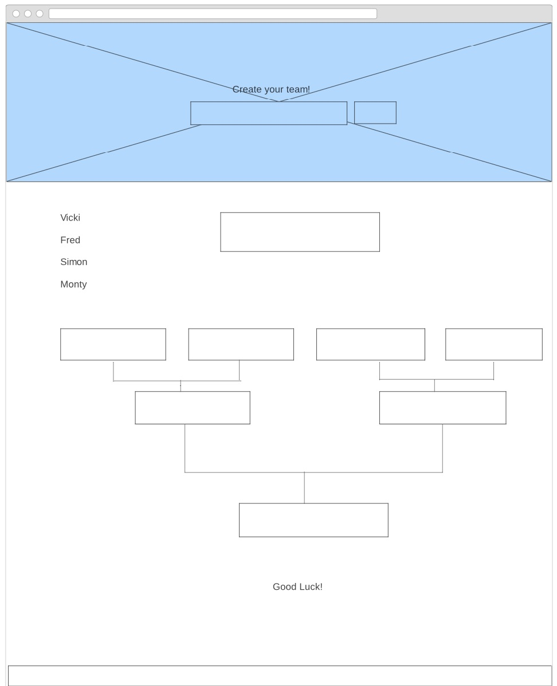

# Table-Tennis-Tournament-generator

The brief

The exercise was to create a tool which randomly creates pairings for a table tennis tournament from a list of names collected from the user.

link to finished tool - http://vicki.developme.space/tournament/

To create this tool I used JavaScript, CSS (SASS) and HTML.

To begin with I created a wireframe for both full screen and mobile-

I stayed pretty faithful to the wireframe, I created the diagram/flowchart just by using divs and styling in CSS. I added a paddle which I drew in CSS.

I used SASS to help me compile my CSS as I knew I would have to use a few different CSS files for different components.
I decided to use CSS Grid for my layout as I feel most comfortable using it, and thought it best suited to the two coloum layout that I wanted. 

I approached this project by first writing the logic for collecting the data from the user and then randomising it into pairings. I then spent the rest of the time styling it in CSS, and trying to make it mobile responisve.

If I had more time I would finish making it mobile responsive. I did spend a lot of time on this but I think due to my use of CSS grid and how I positioned some elements I could not get it to work in time! I would also like to add in more logic so that I can put some form validation on (for example letters only in team names) and also have it so that the user can add in more than four players. I also wanted to be able to click on the second round box and display the winners name in the final box, but unfortuantely I could not get this working in time.

